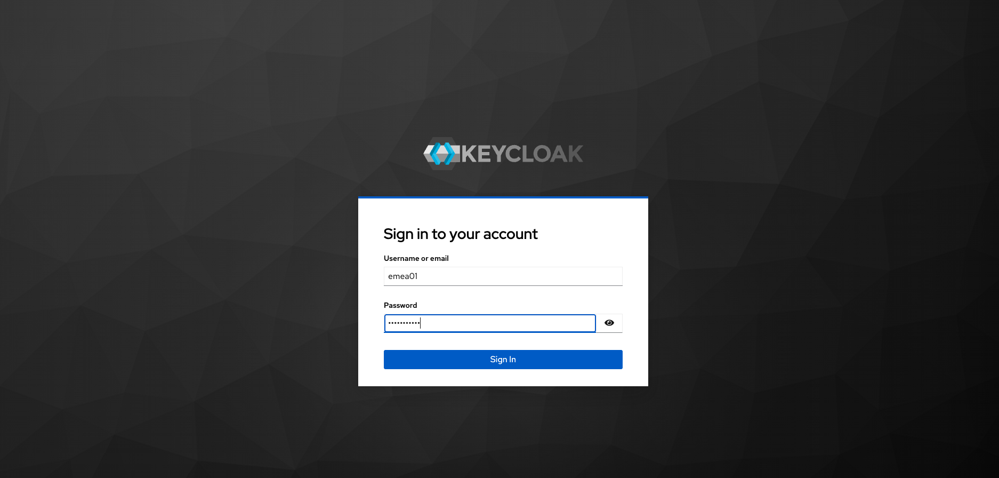
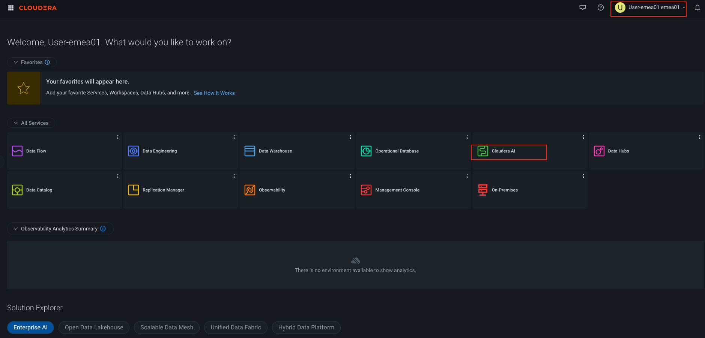
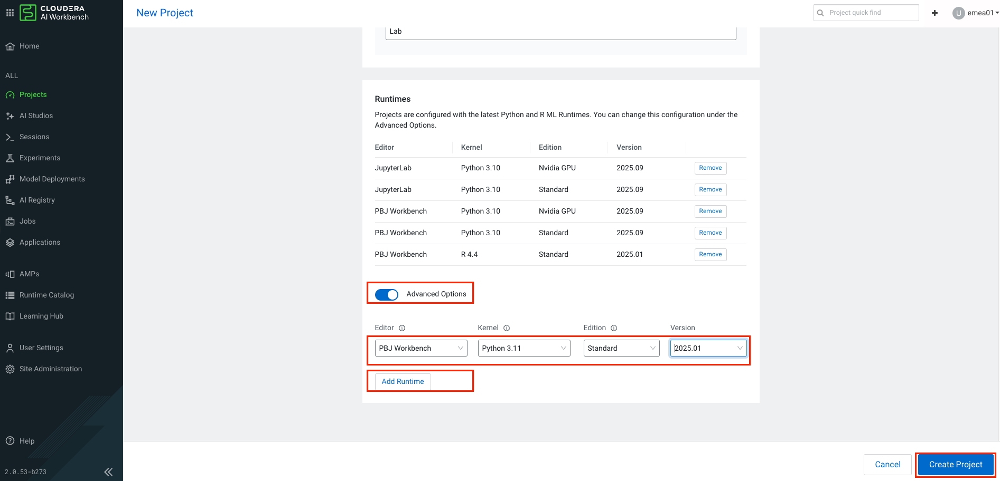
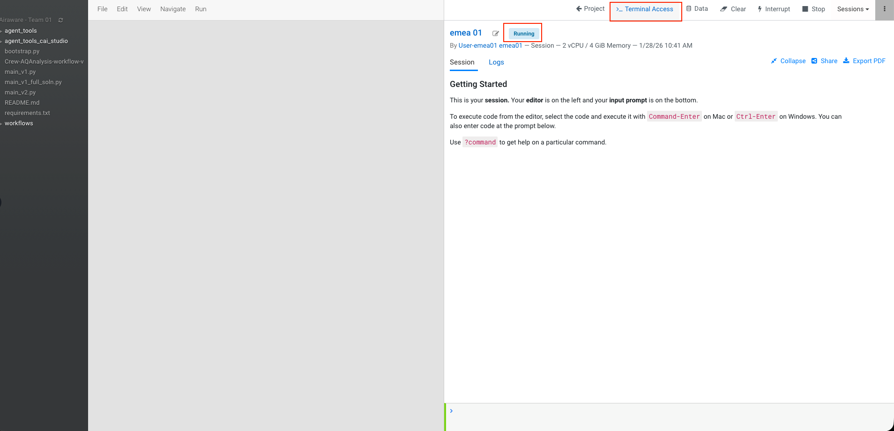
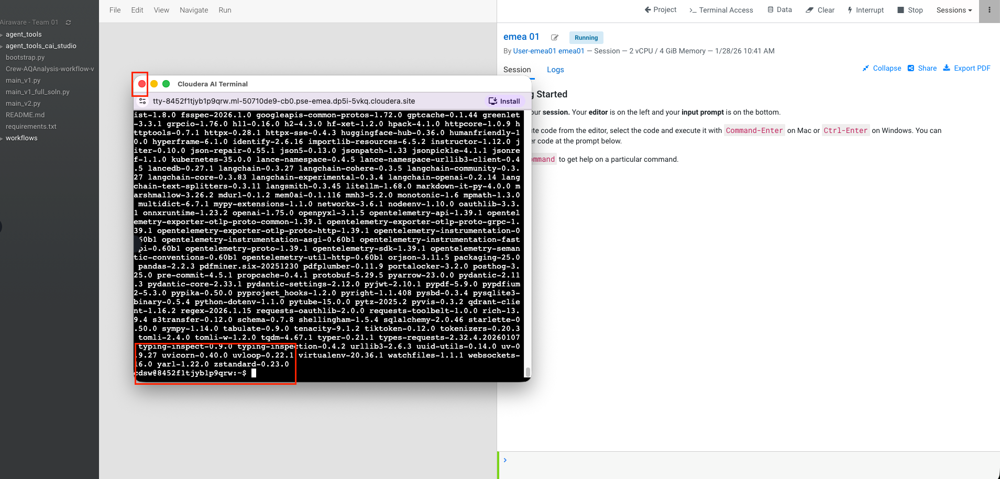

# Lab 1: Getting Setup for Workshop

## API Access Setup 

* Create an Account in Open Air quality Website  at [https://explore.openaq.org/register](https://explore.openaq.org/register).


**!!!Hint:** <br>
    Strong Password suggestions : AI.agents.rocks.XX(Your Team Number)

* Now Login to the OpenAQ account and generate API Key in account settings.


* Copy this API key and save it carefully in a notepad. You will need to access it later to create an Environment variable with the name `OPENAQ_API_KEY`.

## Accessing Cloudera Environment:

- [ ] Click [here](https://pse-emea.clouderapartners.click/realms/master/protocol/saml/clients/cdp-sso) to open a Keycloak login page to get access into the Cloudera environment. Check with the instructor to get access credentials. Use your unique username and password to login and confirm by checking the profile name after you have logged in. Look at the screenshots below. 



- [ ] You'll see a landing page like below. If you are asked for a pop up to enable latest UI enable it. Click on `Cloudera AI`




- [ ] Your Workspace Name is listed below and the XX represents the number assigned to you like 01,02,03 and so on. 

| Cloudera Tenant Name     | Workspace Name | Project Names  |
|--------------------------|----------------|-------------------------|
| pse-emea-cdp-env         |   emeapse        | Airaware-Team-XX        |


## Objectives

We will learn to:

- [ ] Set up the components required for a hand coded Agentic workflow  
- [ ] We will be using the earlier created  `OPENAQ_API_KEY` and a new key `OPENAI_API_KEY` (provided by the instructor)

## Lab Steps
 
### Setup Your CAI  Project
* Click on the workspace `emeapse`


* Click on `Create a new project` in CAI


* Give a name like `Airaware - Team -XX` where `XX` is the number assigned to you.The project should be of type **Git** and use the following settings:
    * Git URL: `https://github.com/SuperEllipse/AirAware.git`
    * Branch: `Lab`
    !!!important
        Make sure you are cloning the **`Lab`** branch and **NOT** the Main branch of the repo above.


* Add a new runtime by toggling the `Advance Options`. Select the appropriate Editor, Kernel, Edition & Version as shown in the screenshot. Then click on `Create Project`.



* The project `Airaware - Team XX` gets created.


* Go to the `Project Settings`, click on  `Advanced Tab` and create 2 environment variables namely `OPENAI_API_KEY` & `OPENAQ_API_KEY`. Enter your OpenAI key as given by instructor and the OpenAQ key that you had created in the earlier step. 


* Now given we have set the environment variables, we will now open the project and start a terminal. Look at the screenshot below to open the project if not already opened. Then click on `New Session` on top right corner.


* Enter an appropriate `Session Name`. Make sure that the `Editor`, `Kernel`, `Edition` & `Version` are correctly selected as shown in the screenshot. Also, make sure you assign `2 vCPU / 4 GiB` only from the drop down. Click `Start Session`.


* The pod will initialize and then a pop up will appear. Close it when it appears.


* Start a new terminal and use the following code in terminal
    ```bash
    pip install -r requirements.txt 
    ```




* You'll then wait for approx `15 minutes` for this to get completed. Probably, a good time for a coffee break. You should see the following after the packages get successfully installed. Close the terminal.





## Learning Notes

- [x] We have set up  the CAI Project. We have set up OPENAQ & OPENAI Keys.

- [x] We have installed the packages needed for the next exercises in our project.

**:rocket: We have now concluded Lab 1 :rocket:**
