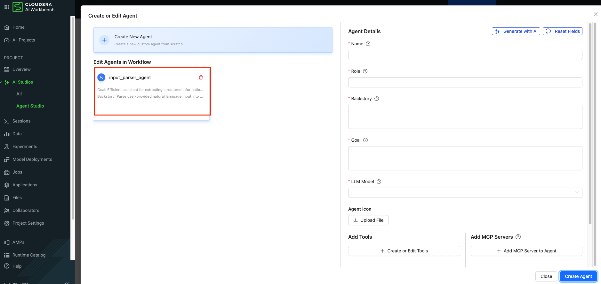
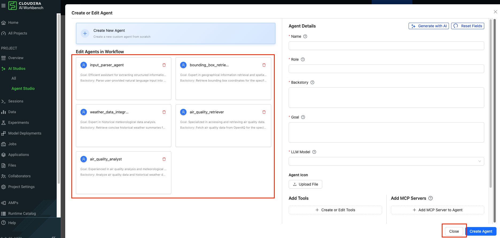

# Lab 1: Create Templates and workflows in Agent Studio

## Objectives

In this Lab we will use Agent Studio to create the same Air quality Investigator System we built earlier, we will learn:

- [ ] Create workflows in Agent Studio
- [ ] Learn how to set up 5 agents, tasks and tools

## Lab Steps

!!! warning "Important"
    Please ensure you use `aistudio-llm-model` as your LLM when creating agents

* Click on `All Projects` from the drop down and then click on `Aramco Agent Studio Project`

* Once, inside the project make sure that you click on `Agent Studio` as shown in the screenshot.  It will open up Agent Studio. Click on `Get Started`. 

* Click on `Create Workflow` button to launch a Workflow Template wizard.

* Create a New template and give a name `Air Aware - Team XX` (use the Name of your Team). Click on `Create Workflow`.

* In the next screen , ensure "Conversational" and "Manager Agent" are disabled. We will discuss what these settings mean.

* Click on `Create or Edit Agents` using the template here. We will be creating a total of 5 Agents using this template

* **Agents Definition:** Use the cell values below against to define each agent. Copy the values in each cell against each type of agent in the code.

!!! warning "Important"
    Please ensure you use `aistudio-llm-model` as your LLM when creating agents

| Agent | Role | Backstory | Goal |
| :---- | :---- | :---- | :---- |
| input_parser_agent | Input Data Parser | Parse user-provided natural language input into structured parameters required for air quality analysis. | Efficient assistant for extracting structured information from user queries. |
| bounding_box_retriever | Geospatial Data Specialist | Retrieve bounding box coordinates for the specified locations. | Expert in geographical information retrieval and spatial data analysis. |
| weather_data_integrator | Historical Weather Data Specialist | Retrieve concise historical weather summaries for the specified locations and dates. | Expert in historical meteorological data analysis. |
| air_quality_retriever | Air Quality Data Retriever | Fetch air quality data from OpenAQ for the specified locations and date range. | Specialized in accessing and retrieving air quality data. |
| air_quality_analyst | Air Quality Analyst | Analyze air quality data and historical weather data to generate a report. | Experienced in air quality analysis and meteorological research.  |

* Fill in the values for the `input_parser_agent` as shown below.

* After you create the `input_parser_agent` create the remaing ones. Once created it will appear as shown below.

* Keep on adding the other agents and make sure you have added all the 5 agents. Click on `Save & Next`.

* We will not use any Tools at this point, we will add the tools later. Also we will not use any MCP Server at this point  

## Learning Notes
- [x] Create workflows in Agent Studio
- [x] We have learnt how to start using AI Studios and create Agents

**:rocket: We have now concluded Lab 1 :rocket:**
