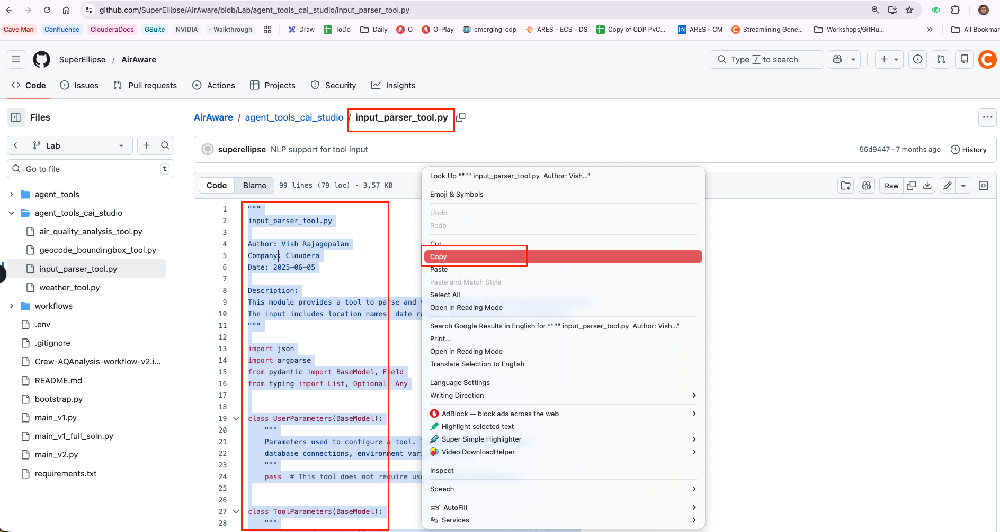
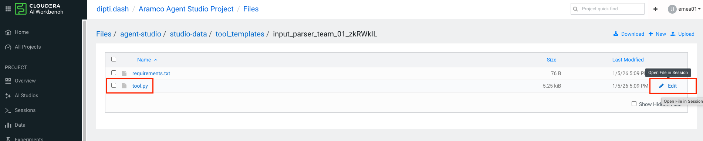
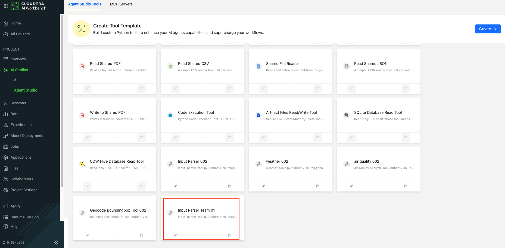
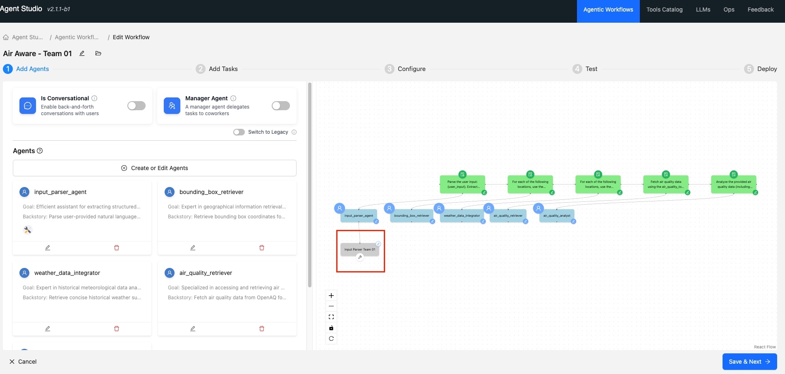

# Lab 3: Create Custom Tools in Agent Studio and equip Agents with these tools.

## Objectives

- [ ] In this Lab, we will connect our Agent Workflows  to APIs and S3 buckets for data processing

- [ ] We will learn to create tools in Tool catalog and use them in workflows.

## Lab Steps

* Let us start by creating Tools in Tools Catalog. Click on `Tools Catalog` and then `Create`.


* Enter the tool name and then click `Generate`.
  * Input Parser  `Input Parser Team XX` (use your team name)

!!! NOTE
    Special characters are not allowed in Tool Name


* Click on Edit tool file show  


!!! Danger "IMPORTANT"
    Branch Name:  “LAB” branch and  Folder Name : “agent_tools_cai_studio” for all the tools. 

* Update the Tool Code : 
    * Goto the Github Location for CAI custom tools [url](https://github.com/SuperEllipse/AirAware/tree/Lab/agent_tools_cai_studio). Make sure you are on the `Lab` branch as shown below. There should be 4 code files there.
    
    * Copy the input_parser_tool.py code into the tool.py file 
    
    * Now you go to the location and update the `input_parser_tool.py` code in Cloudera AI `tool.py`file. Paste the code here and then  `Save` and `Close` the file.
    
    
    
    

* Refresh and check that the `input_parser_tool.py` is updated. Finally save the tool clicking on the `Save` button below.





!!! danger "Important"
    Using the same method we have created 3 more tools namely - `Geocode Boundingbox Tool`, `Weather Tool`, `Air Quality Analysis Tool` which you will be using in the next steps. For the Air Quality Analysis Tool, we need some additional packages, so we have updated `requirements.txt` corresponding to `Air Quality Analysis Tool` with the packages below as well. This is just FYI.
    ```
    #UPDATE THE requirements.txt with the below
    # https://pip.pypa.io/en/stable/reference/requirements-file-format/
    pydantic
    boto3==1.38.17
    pandas==2.2.3
    ```


* Confirm in Tools Catalog if the tools that you have created are listed.

* Now let us go back to our workflow and click on `Air Aware - Team XX` (Your workflow).


* You might have to then click `Edit & Redeploy`.


* In the Workflow click on create or edit agents.


* Select the Input_parser_agent and click in the  `Add optional tools` section `Create or Edit Tools`.


* Find your tool name from tool catalog and check if the code is correct or not.


    
* Click on the `Create Tool from Template` button which adds the tool.


* Click on `Close` button.


* Notice how the agent now has a tool associated with it in the workflow as below  



* Follow the same approach to add all the other tools (`Geocode Boundingbox Tool`, `Weather Tool`, `Air Quality Analysis Tool`) to our agentic workflow. Finally, your workflow should look like below. Click on `Save & Next` as we move to the next exercise.


## Learning Notes

- [x] In this lab we learnt how to create Custom Tools in Agent Studio and have agents equipped with these tools.

**:rocket: We have now concluded Lab 3 :rocket:**
