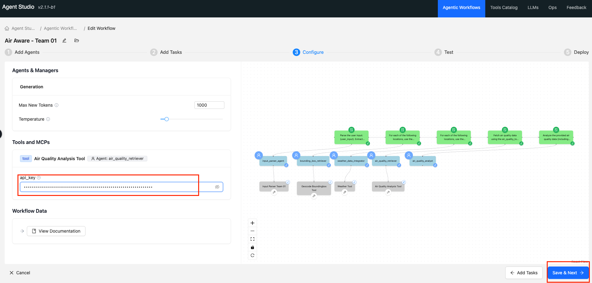
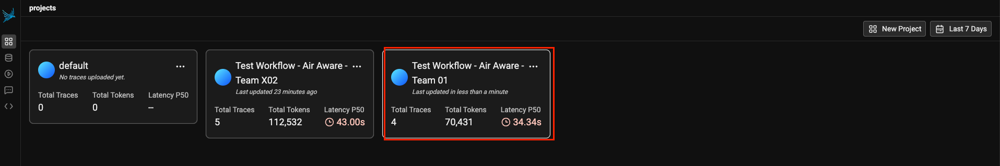
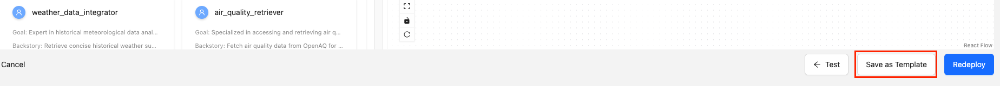
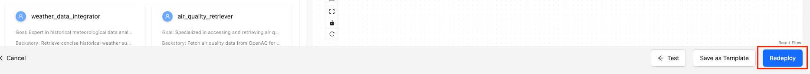
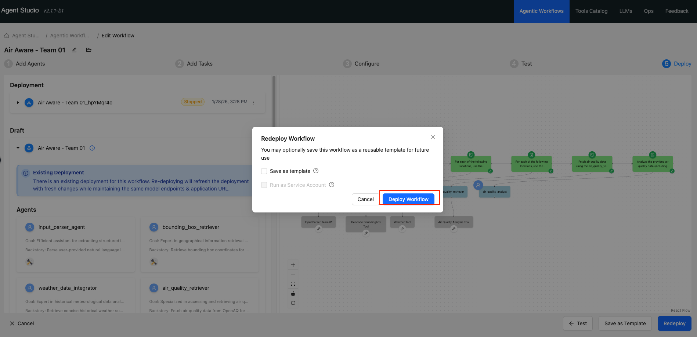
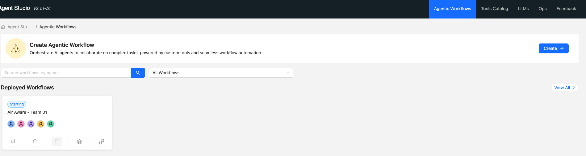
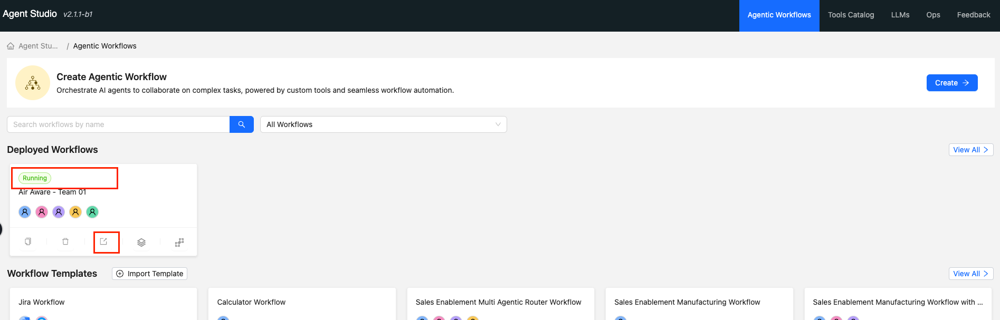

# Lab 4: Test, Monitor and Deploy Workflows

## Objectives

- [ ] In this Lab, we will test our Agentic Workflow, Monitor it and Deploy it as an Application

## Lab Steps
* Continue from the last lab where you were on the step of `Add Tasks` for your workflow named `Air Aware - Team XX`. Click on `Save & Next`.


* Enter the API Key you created from the Open AQ website in [Getting Setup for Workshop](../module1/lab1.md) lab. Click `Save & Next`.



* Test the workflow by adding the following text in `user_input` text box below. Then click `Run Workflow`.

```text {.prompt-block}
Can you provide an air quality report for AlKhobar, Saudi Arabia  between 01.Jan.2025 to 03.Jan.2025 focussing on pm25 parameter
```


* Click on the `Monitoring` Icon Tab to monitor your workflow using Phoenix.


* You should be able to use Phoenix to monitor your workflow by clicking on the name of your Project as shown below.




* Check the workflow for each tool. For example the below shows the workflow for the Input Parser Agent, which has used the tool to parse the user input


*  If the Workflow has executed properly, you should be able to see the output below as a final Air quality report the user is expected to get. Then click on `Save & Next`


* First save your workflow as a Template and then `Deploy`.







!!! note 
    It may take between 5-10 minutes to deploy your application

* You may need to open the workflow again and click on the `Actions` Menu item to deploy.



* Once deployed successfully, you should be able to see the workflow in the main Deployed Workflows section as below and it should be in running state. Click on the application link as shown below.



* This should open a UI Page below, let us test with `user_input` comparing Air Quality of 3 days for a different city by entering the following input. Click on `Rub Workflow` after entering the `user_input`.

```text {.prompt-block}
Can you provide an air quality report for AlKhobar between 01.Jan.2025 to 03.Jan.2025 focussing on pm25 parameter
```


* After a few minutes you should be able to get a complete Air Quality report (partially shown in the screenshot below)


* Scroll down to download the entire report on your laptop.

## Learning Notes

- [x] In this lab we learnt how to test our Agentic Workflow, Monitor it and Deploy it as an Application

**:rocket: We have now concluded Lab 4 :rocket:**

**:rocket: This concludes our Hands on Workshop :rocket:**